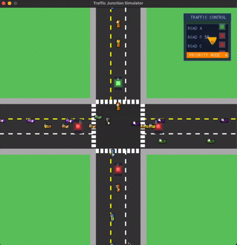

# DSA Queue Simulator

It is a traffic junction simulator with queue implementation. I have used SDL (Simple Direct Media Layer) version 3. The programming language used to make this application is C++ v17. I have used CMake to build.

This project is an assignment for 3rd semester Data Structure and Algorithm.



## How to run the project

Clone the repo:
```bash
git clone https://github.com/usmga/dsa-queue-simulator
